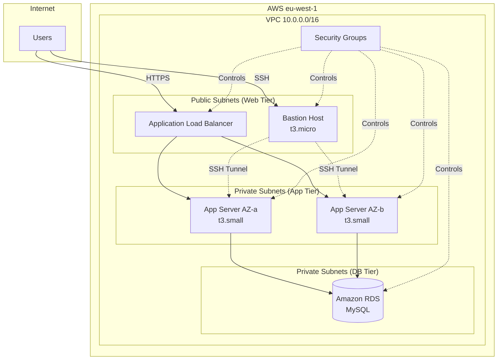

# Terraform AWS EcoShop

> Infrastructure as Code for migrating a PHP/Node.js e-commerce application with MySQL to AWS using a modular 3-tier architecture.


## Architecture



## Features

- **Multi-AZ deployment** across `eu-west-1a` and `eu-west-1b` for high availability
- **3-tier network isolation**: Web (public), App (private), Database (private) subnets
- **Application Load Balancer** with health checks and target group routing
- **Bastion Host** for secure SSH access to private instances
- **RDS MySQL** in a dedicated DB subnet group
- **Modular Terraform structure** with reusable modules for network, security, compute, RDS, and ALB
- **Auto-generated SSH key pair** using TLS provider

## Tech Stack

| Category | Technology |
|----------|-----------|
| IaC | Terraform |
| Cloud | AWS (VPC, EC2, RDS, ALB) |
| Region | eu-west-1 (Ireland) |
| Database | MySQL (RDS) |
| Application | PHP / Node.js |
| Access | Bastion Host + SSH Key |

## Getting Started

### Prerequisites

- [Terraform](https://www.terraform.io/downloads) >= 1.0
- AWS CLI configured with appropriate credentials
- An AWS account with VPC/EC2/RDS permissions

### Installation

```bash
git clone https://github.com/g-holali-david/terraform-aws-ecoshop.git
cd terraform-aws-ecoshop
terraform init
```

### Usage

```bash
# Preview changes
terraform plan -var="admin_ip=YOUR_PUBLIC_IP/32" -var="app_ami=ami-xxxxx"

# Apply infrastructure
terraform apply -var="admin_ip=YOUR_PUBLIC_IP/32" -var="app_ami=ami-xxxxx"

# Tear down
terraform destroy
```

## Project Structure

```
terraform-aws-ecoshop/
├── main.tf                  # Root module — orchestrates all modules
├── variables.tf             # Input variables (VPC CIDR, AMIs, credentials)
├── outputs.tf               # Output values (IPs, endpoints)
├── terraform.tfvars         # Variable values
├── diagrams/
│   ├── aws_architecture_ecoshop.png
│   └── adressage-ip.png
└── modules/
    ├── network/             # VPC, subnets, IGW, NAT, route tables
    ├── security/            # Security groups (bastion, app, db, web)
    ├── compute/             # EC2 instances (bastion + app servers)
    ├── rds/                 # RDS MySQL instance + subnet group
    └── alb/                 # Application Load Balancer + target group
```

## Diagrams

Architecture and IP addressing diagrams are available in the `diagrams/` directory.

## Author

**Holali David GAVI** — Cloud & DevOps Engineer
- Portfolio: [gholalidavid.com](https://gholalidavid.com)
- GitHub: [@g-holali-david](https://github.com/g-holali-david)
- LinkedIn: [Holali David GAVI](https://www.linkedin.com/in/holali-david-g-4a434631a/)

## License

MIT
